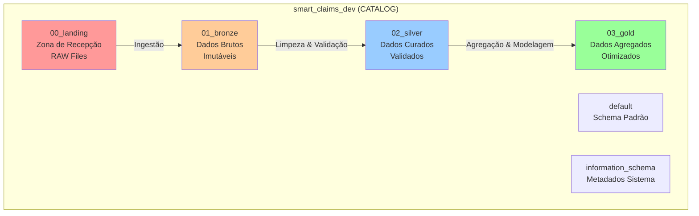
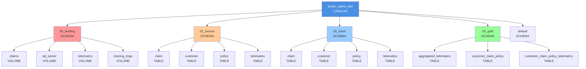
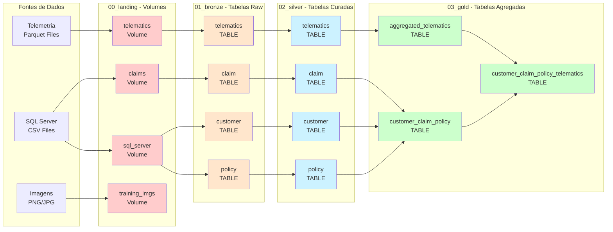
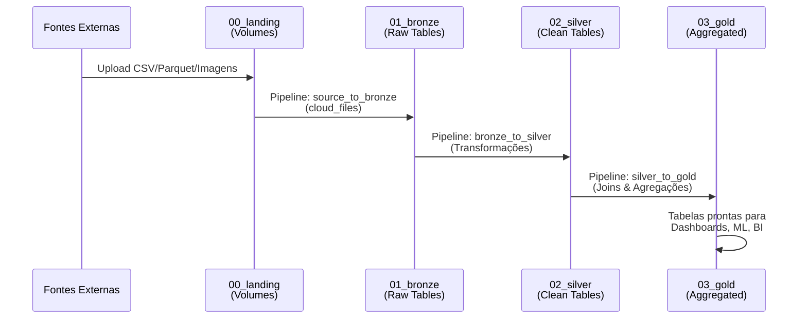

# Smart Claims - Projeto Databricks

## 📋 Sobre o Projeto

**Smart Claims** é um projeto de análise e processamento de sinistros (claims) utilizando a plataforma **Databricks** e a arquitetura moderna de **Lakehouse** com **Unity Catalog** (Lakeflow). O projeto implementa o padrão **Medallion Architecture** para garantir qualidade, rastreabilidade e governança de dados.

### Objetivos do Projeto

- Processar e analisar dados de sinistros de forma eficiente e escalável
- Implementar governança de dados com Unity Catalog
- Criar uma arquitetura de dados em camadas (Landing → Bronze → Silver → Gold)
- Facilitar análises, relatórios e modelos de Machine Learning sobre sinistros

---

## 🏗️ Arquitetura de Dados

O projeto segue o padrão **Medallion Architecture**, organizando dados em camadas progressivas:



### Estrutura Hierárquica do Catálogo



### Descrição das Camadas

| Camada | Propósito | Retenção | Formato |
|--------|-----------|----------|---------|
| **00_landing** | Recepção inicial de dados de sistemas externos | 7 dias | RAW (CSV, Parquet, Imagens) |
| **01_bronze** | Preservação imutável dos dados originais | 365 dias | Delta Lake (append-only) |
| **02_silver** | Dados limpos, validados e enriquecidos | 730 dias | Delta Lake (schema definido) |
| **03_gold** | Dados agregados e otimizados para consumo final | 2555 dias | Delta Lake (otimizado, particionado) |

### Fluxo Completo de Dados



---

## 📁 Estrutura do Repositório

```text
smart_claims_dev/
├── README.md                              # Este arquivo - documentação principal
├── EXPLICACAO_CATALOG.md                  # Documentação detalhada sobre Unity Catalog
├── 01_create_catalog_and_schemas.ipynb   # Notebook: Task_001 - Criar catálogo e schemas
├── 02_create_volumes_and_load_data.ipynb  # Notebook: Task_002 - Criar volumes
├── ingest_sql/                            # Scripts SQL para pipelines DLT
│   ├── README.md                          # Documentação dos pipelines
│   ├── source_to_bronze/                  # Ingestão: Volumes → Bronze
│   │   ├── get_claim.sql
│   │   ├── get_customers.sql
│   │   ├── get_policies.sql
│   │   └── get_telematics.sql
│   ├── bronze_to_silver/                  # Transformação: Bronze → Silver
│   │   ├── clean_claim.sql
│   │   ├── clean_customer.sql
│   │   ├── clean_policy.sql
│   │   └── clean_telematics.sql
│   └── silver_to_gold/                    # Agregação: Silver → Gold
│       ├── aggregated_telematics.sql
│       ├── customer_claim_policy.sql
│       └── customer_claim_policy_telematics.sql
└── data/                                  # Dados de exemplo
    ├── claims/                            # Imagens e metadata de sinistros
    ├── sql_server/                        # CSV do SQL Server
    │   ├── claims.csv
    │   ├── customers.csv
    │   └── policies.csv
    ├── telematics/                        # Arquivos Parquet de telemetria
    └── training_imgs/                     # Imagens PNG para treinamento ML
```

---

## ✅ Task_001 - Criação do Catálogo e Schemas

### Objetivo

Criar a estrutura base do projeto no Databricks utilizando **Unity Catalog**, incluindo o catálogo principal e todos os schemas necessários para implementar a arquitetura Medallion.

### O que foi Implementado

#### 1. **Criação do Catálogo `smart_claims_dev`**

Foi criado um catálogo completo no Unity Catalog conforme implementado no notebook:

```sql
CREATE CATALOG IF NOT EXISTS smart_claims_dev
COMMENT 'Catálogo principal para o projeto Smart Claims - Ambiente de Desenvolvimento'
```

Seguido pelo comando para usar o catálogo:

```sql
USE CATALOG smart_claims_dev
```

**Exemplos concretos do que isso proporciona:**

- ✅ Isolamento lógico de todos os dados do projeto Smart Claims
- ✅ Comentário descritivo para documentação e rastreabilidade
- ✅ Base para compartilhamento entre workspaces/organizações
- ✅ Governança centralizada de permissões e políticas

#### 2. **Criação dos 6 Schemas**

Cada schema foi criado com propriedades específicas e comentários descritivos:

##### **00_landing** - Zona de Recepção

```sql
CREATE SCHEMA IF NOT EXISTS smart_claims_dev.00_landing
COMMENT 'Zona de landing - recepção de dados brutos de sistemas externos'
```

**Exemplo de uso:** Tabelas como `raw_claims_api`, `raw_policies_export`, `raw_customer_data` receberiam dados diretamente de APIs ou sistemas externos.

##### **01_bronze** - Preservação de Dados Brutos

```sql
CREATE SCHEMA IF NOT EXISTS smart_claims_dev.01_bronze
COMMENT 'Camada Bronze - dados brutos preservados de forma imutável'
```

**Exemplo de uso:** Tabelas como `bronze.claims_raw`, `bronze.policies_raw`, `bronze.customers_raw` manteriam uma cópia imutável de todos os dados originais, permitindo auditoria e reprocessamento histórico.

##### **02_silver** - Dados Curados

```sql
CREATE SCHEMA IF NOT EXISTS smart_claims_dev.02_silver
COMMENT 'Camada Silver - dados limpos, validados e enriquecidos'
```

**Exemplo de uso:** Tabelas como `silver.claims_clean`, `silver.claims_enriched`, `silver.customers_master` conteriam dados após:

- Validação de tipos e formatos
- Remoção de duplicatas
- Enriquecimento com dados de referência
- Normalização de estruturas

##### **03_gold** - Dados para Consumo Final

```sql
CREATE SCHEMA IF NOT EXISTS smart_claims_dev.03_gold
COMMENT 'Camada Gold - dados agregados e modelados para consumo final'
```

**Exemplo de uso:** Tabelas como `gold.claims_by_month`, `gold.claims_summary`, `gold.customer_claims_facts` seriam otimizadas para:

- Dashboards executivos
- Modelos de Machine Learning
- Relatórios analíticos
- Star schemas para BI tools

##### **default** - Schema Padrão

Schema padrão do catálogo para objetos que não requerem organização específica por camada.

##### **information_schema** - Metadados do Sistema

Schema automático do Unity Catalog que contém metadados sobre todos os objetos do catálogo (tabelas, views, funções, etc.).

#### 3. **Comandos de Verificação Incluídos**

O notebook inclui comandos para validação da estrutura criada, cada um em uma célula separada:

```sql
-- Listar catálogos
SHOW CATALOGS LIKE 'smart_claims*'

-- Listar schemas no catálogo
SHOW SCHEMAS IN smart_claims_dev

-- Descrever catálogo
DESCRIBE CATALOG smart_claims_dev

-- Descrever schema específico
DESCRIBE SCHEMA smart_claims_dev.00_landing
```

### Arquivos Gerados

1. **`01_create_catalog_and_schemas.ipynb`**
   - Notebook Databricks completo com células SQL
   - Cada comando SQL em uma célula separada para execução individual
   - Comentários markdown explicando cada comando e sua função
   - Comandos de verificação incluídos
   - Idempotente (pode ser executado múltiplas vezes sem erro)
   - Pronto para execução no Databricks Workspace

2. **`EXPLICACAO_CATALOG.md`**
   - Documentação completa sobre Unity Catalog
   - Explicação detalhada de cada comando SQL
   - Descrição da Medallion Architecture
   - Guia de melhores práticas

### Como Executar

1. **Importe o notebook no Databricks:**
   - No workspace, vá em **Workspace** → **Import**
   - Selecione o arquivo `01_create_catalog_and_schemas.ipynb`
   - Ou arraste e solte o arquivo na interface

2. **Execute as células sequencialmente:**
   - Execute as células markdown (apenas para leitura)
   - Execute as células SQL uma por uma ou use "Run All"
   - Cada comando SQL está em uma célula separada

3. **Verifique os resultados:**
   - Execute as células de verificação (SHOW CATALOGS, SHOW SCHEMAS, DESCRIBE)
   - Confirme que o catálogo e todos os schemas foram criados com sucesso

### Resultado Esperado

Após a execução bem-sucedida do notebook, você terá:

- ✅ 1 catálogo criado: `smart_claims_dev` com comentário descritivo
- ✅ 4 schemas principais criados (00_landing, 01_bronze, 02_silver, 03_gold)
- ✅ Schema `default` disponível para uso geral
- ✅ Schema `information_schema` criado automaticamente pelo Unity Catalog
- ✅ Estrutura completa para iniciar ingestão de dados
- ✅ Base sólida para implementar pipelines de dados seguindo Medallion Architecture
- ✅ Governança de dados configurada com Unity Catalog

### Estrutura do Notebook

O notebook está organizado em 3 partes principais:

1. **Parte 1: Criar o Catálogo** (2 células SQL)
   - CREATE CATALOG
   - USE CATALOG

2. **Parte 2: Criar os Schemas** (4 células SQL)
   - CREATE SCHEMA para cada camada (00_landing, 01_bronze, 02_silver, 03_gold)

3. **Parte 3: Verificação** (4 células SQL)
   - SHOW CATALOGS
   - SHOW SCHEMAS
   - DESCRIBE CATALOG
   - DESCRIBE SCHEMA

### Pipeline Completo de Dados



### Próximos Passos

Após concluir a Task_001, as próximas etapas incluem:

- **Task_002**: Criar volumes no schema 00_landing e carregar arquivos (✅ Concluída)
- **Task_003**: Executar pipelines de ingestão (source_to_bronze) ✅ Concluída
- **Task_004**: Executar transformações (bronze_to_silver) ✅ Concluída
- **Task_005**: Executar agregações (silver_to_gold) ✅ Concluída
- **Task_006**: Configurar permissões e roles (data engineers, analysts, etc.)
- **Task_007**: Configurar monitoramento, alertas e qualidade de dados

---

## ✅ Task_002 - Criar Volumes e Carregar Dados no Schema 00_landing

### Objetivo

Criar volumes no schema `00_landing` para armazenar os arquivos CSV brutos da pasta `data/` e implementar métodos para fazer upload desses arquivos para os volumes do Unity Catalog.

### Arquivos Envolvidos

A Task_002 trabalha com 3 arquivos CSV brutos que contêm os dados do projeto Smart Claims:

- **`claims.csv`** - Dados de sinistros (claims) com aproximadamente 12.990 registros
  - Contém informações sobre sinistros: data, valor, tipo de colisão, severidade, etc.
  - Colunas: `claim_no`, `policy_no`, `claim_date`, `total`, `collision_type`, `severity`, etc.
  
- **`customers.csv`** - Dados de clientes com aproximadamente 7.060 registros
  - Contém informações demográficas dos clientes
  - Colunas: `customer_id`, `date_of_birth`, `borough`, `neighborhood`, `zip_code`, `name`
  
- **`policies.csv`** - Dados de apólices com aproximadamente 12.230 registros
  - Contém informações sobre apólices de seguro
  - Colunas: `POLICY_NO`, `CUST_ID`, `POLICYTYPE`, `MAKE`, `MODEL`, `SUM_INSURED`, `PREMIUM`, etc.

### O que foi Implementado

#### 1. **Criação de 3 Volumes no Schema 00_landing**

Foram criados volumes para organizar cada tipo de arquivo CSV de forma isolada:

```sql
-- Volume para dados de sinistros (claims)
CREATE VOLUME IF NOT EXISTS smart_claims_dev.`00_landing`.claims_volume
COMMENT 'Volume para armazenar arquivos CSV de sinistros';
```

**Exemplo de uso:** O volume `claims_volume` armazena o arquivo `claims.csv` que contém todos os registros de sinistros recebidos. Este volume serve como ponto de entrada para dados brutos que serão posteriormente processados e movidos para a camada Bronze.

```sql
-- Volume para dados de clientes (customers)
CREATE VOLUME IF NOT EXISTS smart_claims_dev.`00_landing`.customers_volume
COMMENT 'Volume para armazenar arquivos CSV de clientes';
```

**Exemplo de uso:** O volume `customers_volume` armazena o arquivo `customers.csv` com informações dos clientes. Este volume permite armazenar dados de referência que serão usados para enriquecer outras tabelas nas camadas seguintes.

```sql
-- Volume para dados de apólices (policies)
CREATE VOLUME IF NOT EXISTS smart_claims_dev.`00_landing`.policies_volume
COMMENT 'Volume para armazenar arquivos CSV de apólices';
```

**Exemplo de uso:** O volume `policies_volume` armazena o arquivo `policies.csv` com informações sobre as apólices de seguro. Este volume contém dados de contrato que serão vinculados aos sinistros no processamento posterior.

**Benefícios concretos:**

- ✅ **Organização**: Cada tipo de dado tem seu próprio container, facilitando gestão e localização
- ✅ **Governança**: Controle de acesso granular através do Unity Catalog (permissões por volume)
- ✅ **Rastreabilidade**: Histórico completo de arquivos recebidos na zona de landing
- ✅ **Isolamento**: Falhas ou problemas em um volume não afetam os outros
- ✅ **Auditoria**: Logs de acesso e modificações para cada volume separadamente

#### 2. **Comandos de Verificação de Volumes**

O notebook inclui comandos SQL para verificar a criação dos volumes:

```sql
-- Listar todos os volumes no schema 00_landing
SHOW VOLUMES IN smart_claims_dev.`00_landing`;
```

**Exemplo de saída esperada:**

```text
volume_name      | volume_type | provider | storage_location
-----------------|-------------|----------|------------------
claims_volume    | MANAGED     | ...      | /Volumes/...
customers_volume | MANAGED     | ...      | /Volumes/...
policies_volume   | MANAGED     | ...      | /Volumes/...
```

#### 3. **Métodos de Upload de Arquivos Implementados**

O notebook fornece **3 métodos diferentes** para fazer upload dos arquivos CSV para os volumes, atendendo diferentes cenários de uso:

##### **Método 1: Upload via UI do Databricks (Recomendado)**

O método mais simples e direto para usuários:

1. No Databricks Workspace, navegue até: **Catalog** → **smart_claims_dev** → **00_landing**
2. Clique no volume desejado (ex: `claims_volume`)
3. Clique em **Upload** ou **Add files**
4. Selecione o arquivo CSV correspondente do seu sistema local
5. Repita para todos os volumes

**Vantagens:**

- Interface gráfica intuitiva
- Validação automática de arquivos
- Progresso visual do upload
- Sem necessidade de código

##### **Método 2: Cópia de Repositório Git para Volumes**

Se o projeto está conectado a um repositório Git no Databricks:

```python
# Caminho do repositório Git no Databricks
repo_path = "/Workspace/Repos/your_username/smart_claims_dev/data"

# Copiar arquivos do repositório para os volumes
dbutils.fs.cp(f"{repo_path}/claims.csv", 
              "/Volumes/smart_claims_dev/00_landing/claims_volume/claims.csv")
dbutils.fs.cp(f"{repo_path}/customers.csv", 
              "/Volumes/smart_claims_dev/00_landing/customers_volume/customers.csv")
dbutils.fs.cp(f"{repo_path}/policies.csv", 
              "/Volumes/smart_claims_dev/00_landing/policies_volume/policies.csv")
```

**Vantagens:**

- Automatização via código
- Ideal para integração CI/CD
- Versionamento através do Git
- Consistência entre ambientes

##### **Método 3: Upload via DBFS e Cópia para Volumes**

Se você precisa fazer upload temporário via DBFS primeiro:

```python
# Passo 1: Fazer upload para DBFS (via UI ou dbutils.fs.put())
# Passo 2: Copiar de DBFS para os volumes
dbutils.fs.cp("dbfs:/FileStore/uploads/claims.csv", 
              "/Volumes/smart_claims_dev/00_landing/claims_volume/claims.csv")
```

**Vantagens:**

- Flexibilidade para diferentes origens de dados
- Útil para dados grandes que precisam de upload incremental
- Permite transformações intermediárias no DBFS

#### 4. **Comandos de Verificação de Arquivos**

Após o upload, o notebook inclui código Python para verificar os arquivos:

```python
# Listar arquivos em cada volume
files = dbutils.fs.ls("/Volumes/smart_claims_dev/00_landing/claims_volume/")
for file in files:
    print(f"  - {file.name} ({file.size} bytes)")
```

**Exemplo de saída esperada:**

```text
=== Arquivos no volume claims_volume ===
  - claims.csv (2847392 bytes)

=== Arquivos no volume customers_volume ===
  - customers.csv (456123 bytes)

=== Arquivos no volume policies_volume ===
  - policies.csv (892456 bytes)
```

#### 5. **Leitura dos CSV como DataFrames Spark (Opcional)**

O notebook inclui exemplos de como ler os arquivos CSV dos volumes diretamente como DataFrames Spark:

```python
# Ler arquivo CSV do volume como DataFrame
df_claims = spark.read \
    .option("header", "true") \
    .option("inferSchema", "true") \
    .csv("/Volumes/smart_claims_dev/00_landing/claims_volume/claims.csv")

# Visualizar dados
df_claims.show(5, truncate=False)
print(f"Total de registros: {df_claims.count()}")
```

**Exemplo de uso:** Esta funcionalidade permite validar os dados antes de criar tabelas Delta, verificar a qualidade dos dados e fazer análises exploratórias.

### Arquivo Gerado

**`02_create_volumes_and_load_data.ipynb`**

Notebook Databricks completo contendo:

- ✅ **Células SQL** para criar os 3 volumes
- ✅ **Células Python** com código para upload via `dbutils`
- ✅ **Múltiplos métodos** de upload para diferentes cenários
- ✅ **Comandos de verificação** para validar criação e upload
- ✅ **Exemplos de leitura** dos CSV como DataFrames Spark
- ✅ **Documentação inline** explicando cada passo
- ✅ **Tratamento de erros** com mensagens informativas

### Como Executar

#### Passo a Passo Completo

1. **Importe o notebook no Databricks:**
   - No workspace, vá em **Workspace** → **Import**
   - Selecione `02_create_volumes_and_load_data.ipynb`
   - Ou arraste e solte o arquivo

2. **Execute as células SQL (Partes 1-3):**
   - Execute as células para garantir que o catálogo existe
   - Execute as células para criar os 3 volumes
   - Execute a célula para verificar os volumes criados

3. **Faça upload dos arquivos CSV:**

   **Opção A - Via UI (Recomendado):**

   - Navegue: Catalog → smart_claims_dev → 00_landing
   - Clique em cada volume → Upload → Selecione o CSV correspondente

   **Opção B - Via Código Python:**
   - Ajuste os caminhos na célula Python (Parte 4)
   - Execute a célula para copiar os arquivos
   - Verifique as mensagens de sucesso/erro

4. **Verifique o upload (Parte 5):**
   - Execute a célula Python de verificação
   - Confirme que os 3 arquivos aparecem nos volumes
   - Verifique os tamanhos dos arquivos

5. **Validação opcional (Parte 6):**
   - Descomente e execute o código para ler os CSV como DataFrames
   - Verifique previews e contagens de registros
   - Valide a estrutura dos dados

### Resultado Esperado

Após a execução bem-sucedida, você terá:

- ✅ **3 volumes criados** no schema `00_landing`:
  - `claims_volume`
  - `customers_volume`
  - `policies_volume`

- ✅ **3 arquivos CSV carregados** nos volumes:
  - `claims.csv` → `claims_volume/claims.csv` (~2.8 MB)
  - `customers.csv` → `customers_volume/customers.csv` (~450 KB)
  - `policies.csv` → `policies_volume/policies.csv` (~890 KB)

- ✅ **Estrutura pronta** para próxima etapa:
  - Arquivos organizados e governados
  - Base para criação de tabelas Delta na camada Bronze
  - Dados validados e acessíveis via Spark

### Estrutura Final da Task_002

```text
smart_claims_dev (CATALOG)
  └── 00_landing (SCHEMA)
      ├── claims_volume (VOLUME)
      │   └── claims.csv (12.990 registros de sinistros)
      ├── customers_volume (VOLUME)
      │   └── customers.csv (7.060 registros de clientes)
      └── policies_volume (VOLUME)
          └── policies.csv (12.230 registros de apólices)
```

### Exemplos de Uso dos Volumes

#### Caso de Uso 1: Validação de Dados

```python
# Ler arquivo do volume e validar
df = spark.read.csv("/Volumes/smart_claims_dev/00_landing/claims_volume/claims.csv", 
                    header=True, inferSchema=True)
# Verificar qualidade dos dados antes de processar
df.filter(df.total.isNull()).count()  # Verificar valores nulos
```

#### Caso de Uso 2: Preparação para Bronze

```python
# Os arquivos nos volumes serão usados na próxima task para criar tabelas Delta
# na camada 01_bronze, preservando os dados brutos imutavelmente
```

#### Caso de Uso 3: Auditoria e Rastreabilidade

```python
# Listar histórico de arquivos recebidos
# Cada arquivo no volume representa um lote de dados recebidos
# Útil para auditoria e compliance
```

### Próximos Passos

Após concluir a Task_002, as próximas etapas incluem:

- **Task_003**: Criar tabelas Delta na camada `01_bronze` a partir dos arquivos CSV nos volumes
- **Task_004**: Implementar transformações e validações (Bronze → Silver)
- **Task_005**: Criar agregados e modelos para consumo final (Silver → Gold)

---

## 📚 Documentação Adicional

Para mais detalhes sobre comandos de Catalog e Unity Catalog, consulte:

- [`EXPLICACAO_CATALOG.md`](EXPLICACAO_CATALOG.md) - Documentação completa sobre Unity Catalog

---

## 🛠️ Tecnologias Utilizadas

- **Databricks** - Plataforma de analytics e processamento de dados
- **Unity Catalog** (Lakeflow) - Sistema de governança de dados unificada
- **Delta Lake** - Formato de armazenamento transacional em lakehouse
- **SQL** - Linguagem para criação e manipulação de objetos

---

## 📝 Notas

- Todos os scripts SQL são **idempotentes** (usam `IF NOT EXISTS`), podendo ser executados múltiplas vezes sem erro
- O projeto está configurado para ambiente de **desenvolvimento** (`dev`)
- A estrutura pode ser replicada para outros ambientes (staging, prod) ajustando o nome do catálogo

---

## 👥 Contribuição

Este é um projeto em desenvolvimento. Para contribuir:

1. Siga o padrão de nomenclatura estabelecido
2. Mantenha a documentação atualizada
3. Teste scripts em ambiente de dev antes de produção
