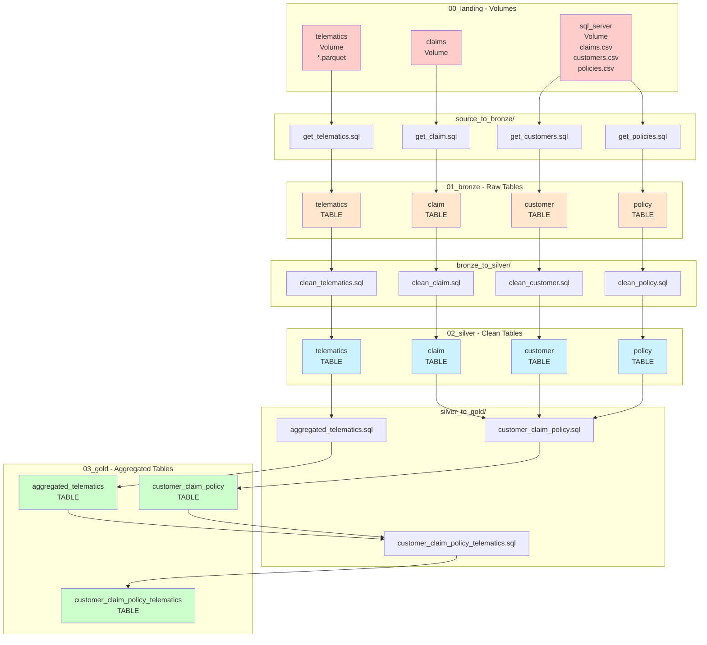
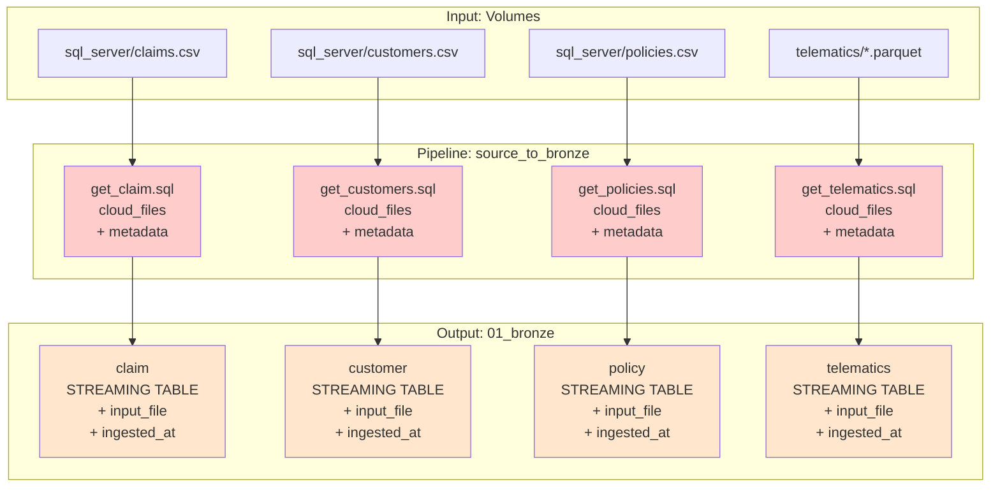
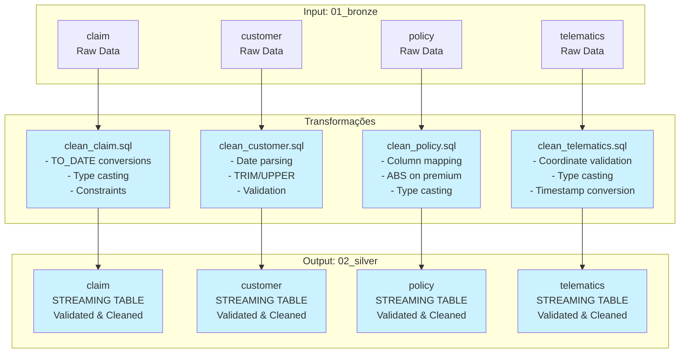
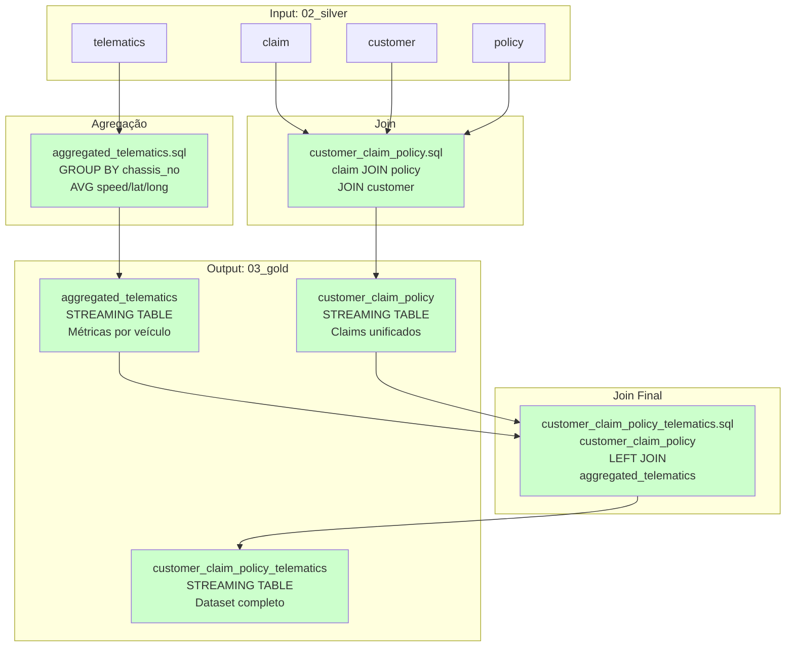
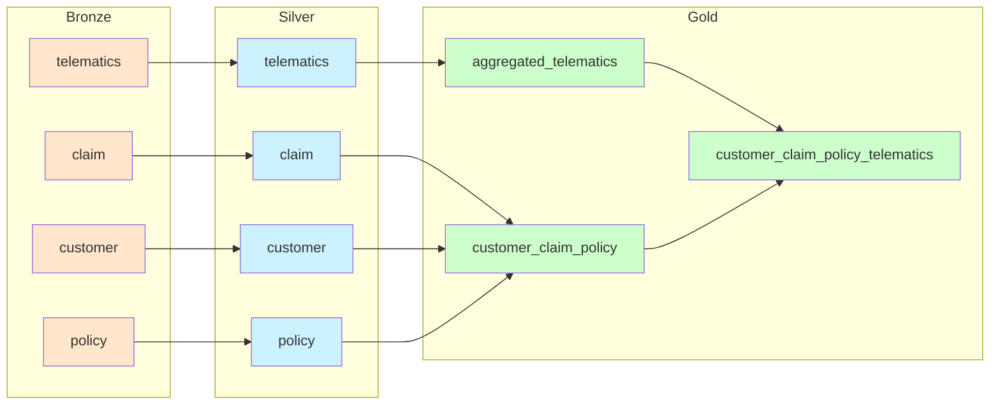

# Pipeline de Ingestão SQL - Smart Claims

Este diretório contém todos os scripts SQL para os pipelines **Delta Live Tables (DLT)** do projeto Smart Claims. Os pipelines seguem a arquitetura Medallion, processando dados desde a ingestão bruta até agregações finais prontas para consumo.

## 📊 Visão Geral do Pipeline



## 📁 Estrutura de Diretórios

```
ingest_sql/
├── README.md                    # Este arquivo
├── source_to_bronze/            # Etapa 1: Ingestão (Volumes → Bronze)
│   ├── get_claim.sql            # Ingesta claims.csv → bronze.claim
│   ├── get_customers.sql        # Ingesta customers.csv → bronze.customer
│   ├── get_policies.sql         # Ingesta policies.csv → bronze.policy
│   └── get_telematics.sql       # Ingesta telematics/*.parquet → bronze.telematics
├── bronze_to_silver/            # Etapa 2: Transformação (Bronze → Silver)
│   ├── clean_claim.sql          # Limpa e valida bronze.claim → silver.claim
│   ├── clean_customer.sql       # Limpa bronze.customer → silver.customer
│   ├── clean_policy.sql         # Limpa bronze.policy → silver.policy
│   └── clean_telematics.sql     # Limpa bronze.telematics → silver.telematics
└── silver_to_gold/              # Etapa 3: Agregação (Silver → Gold)
    ├── aggregated_telematics.sql # Agrega silver.telematics → gold.aggregated_telematics
    ├── customer_claim_policy.sql # Join: silver.{claim,policy,customer} → gold.customer_claim_policy
    └── customer_claim_policy_telematics.sql # Join final com telemetria agregada
```

## 🔄 Fluxo de Transformação Detalhado

### Fase 1: source_to_bronze (Ingestão)



**Características:**
- Usa `cloud_files()` para leitura incremental de arquivos
- Adiciona metadados: `input_file`, `input_file_mtime`, `ingested_at`
- Preserva dados brutos imutáveis (append-only)
- Streaming tables para processamento incremental

### Fase 2: bronze_to_silver (Transformação)



**Transformações Aplicadas:**
- **Claim**: Conversão de datas, validação de horas (0-23), type casting
- **Customer**: Parse de datas, normalização de strings, validação de zip_code
- **Policy**: Mapeamento de colunas, normalização de valores (ABS premium), type casting
- **Telematics**: Validação de coordenadas (lat/long), conversão de timestamps, type casting

### Fase 3: silver_to_gold (Agregação)



**Agregações:**
- **aggregated_telematics**: Médias de velocidade, latitude e longitude por `chassis_no`
- **customer_claim_policy**: Join completo de claims com policies e customers
- **customer_claim_policy_telematics**: Dataset final com telemetria agregada

## 🔗 Dependências entre Tabelas



## 📋 Detalhamento dos Scripts

### source_to_bronze/

#### `get_claim.sql`
- **Fonte**: `/Volumes/smart_claims_dev/00_landing/sql_server/claims.csv`
- **Destino**: `smart_claims_dev.01_bronze.claim`
- **Tipo**: STREAMING LIVE TABLE
- **Função**: Ingesta dados brutos de sinistros preservando estrutura original

#### `get_customers.sql`
- **Fonte**: `/Volumes/smart_claims_dev/00_landing/sql_server/customers.csv`
- **Destino**: `smart_claims_dev.01_bronze.customer`
- **Tipo**: STREAMING LIVE TABLE
- **Função**: Ingesta dados brutos de clientes preservando estrutura original

#### `get_policies.sql`
- **Fonte**: `/Volumes/smart_claims_dev/00_landing/sql_server/policies.csv`
- **Destino**: `smart_claims_dev.01_bronze.policy`
- **Tipo**: STREAMING LIVE TABLE
- **Função**: Ingesta dados brutos de apólices preservando estrutura original

#### `get_telematics.sql`
- **Fonte**: `/Volumes/smart_claims_dev/00_landing/telematics/*.parquet`
- **Destino**: `smart_claims_dev.01_bronze.telematics`
- **Tipo**: STREAMING LIVE TABLE
- **Função**: Ingesta dados brutos de telemetria veicular

### bronze_to_silver/

#### `clean_claim.sql`
- **Fonte**: `smart_claims_dev.01_bronze.claim`
- **Destino**: `smart_claims_dev.02_silver.claim`
- **Tipo**: STREAMING TABLE
- **Transformações**:
  - Conversão de datas: `TO_DATE(claim_date)`, `TO_DATE(incident_date)`
  - Type casting: `BIGINT`, `INT`, `DOUBLE`, `BOOLEAN`
  - Constraints: `valid_claim_number`, `valid_incident_hour`

#### `clean_customer.sql`
- **Fonte**: `smart_claims_dev.01_bronze.customer`
- **Destino**: `smart_claims_dev.02_silver.customer`
- **Tipo**: STREAMING TABLE
- **Transformações**:
  - Parse de data: `TO_DATE(date_of_birth, 'dd-MM-yyyy')`
  - Normalização: `UPPER(TRIM(borough))`, `TRIM(neighborhood)`
  - Constraints: `valid_customer_id`, `valid_zip_code`

#### `clean_policy.sql`
- **Fonte**: `smart_claims_dev.01_bronze.policy`
- **Destino**: `smart_claims_dev.02_silver.policy`
- **Tipo**: STREAMING TABLE
- **Transformações**:
  - Mapeamento de colunas: `POLICY_NO` → `policy_no`
  - Normalização: `ABS(CAST(PREMIUM AS DOUBLE))`
  - Conversões de data: `TO_DATE(POL_ISSUE_DATE)`, etc.
  - Constraints: `valid_policy_no`

#### `clean_telematics.sql`
- **Fonte**: `smart_claims_dev.01_bronze.telematics`
- **Destino**: `smart_claims_dev.02_silver.telematics`
- **Tipo**: STREAMING TABLE
- **Transformações**:
  - Type casting: `DOUBLE`, `TIMESTAMP`, `STRING`
  - Constraints: `valid_coordinates` (latitude -90 a 90, longitude -180 a 180)

### silver_to_gold/

#### `aggregated_telematics.sql`
- **Fonte**: `smart_claims_dev.02_silver.telematics`
- **Destino**: `smart_claims_dev.03_gold.aggregated_telematics`
- **Tipo**: STREAMING TABLE
- **Agregações**:
  - `AVG(speed)` → `telematics_speed`
  - `AVG(latitude)` → `telematics_latitude`
  - `AVG(longitude)` → `telematics_longitude`
  - `COUNT(*)` → `telematics_event_count`
  - `MIN/MAX(event_timestamp)` → timestamps de primeira/última ocorrência

#### `customer_claim_policy.sql`

- **Fontes**:
  - `smart_claims_dev.02_silver.claim`
  - `smart_claims_dev.02_silver.policy`
  - `smart_claims_dev.02_silver.customer`
- **Destino**: `smart_claims_dev.03_gold.customer_claim_policy`
- **Tipo**: STREAMING TABLE
- **Joins**:
  - `claim JOIN policy ON policy_no`
  - Resultado `JOIN customer ON cust_id = customer_id`
- **Campos adicionais**: Campo `address` construído para geocoding futuro

#### `customer_claim_policy_telematics.sql`

- **Fontes**:
  - `smart_claims_dev.03_gold.customer_claim_policy`
  - `smart_claims_dev.03_gold.aggregated_telematics`
- **Destino**: `smart_claims_dev.03_gold.customer_claim_policy_telematics`
- **Tipo**: STREAMING TABLE
- **Join**: `LEFT JOIN aggregated_telematics ON chassis_no`
- **Constraint**: `valid_borough EXPECT (borough IS NOT NULL)`
- **Campos adicionais**: `geocoded_latitude`, `geocoded_longitude` (NULL, para preenchimento futuro)

## 🚀 Como Executar

### Opção 1: Delta Live Tables Pipeline

1. **Criar Pipeline no Databricks:**
   - Vá em **Delta Live Tables** → **Create Pipeline**
   - Configure a pasta `ingest_sql` como source
   - Selecione o catálogo de destino: `smart_claims_dev`

2. **Executar Pipeline:**
   - Clique em **Start** para executar o pipeline completo
   - Ou use **Run file** para executar um script individual

3. **Monitorar Execução:**
   - Acompanhe progresso na interface do pipeline
   - Verifique logs e métricas de qualidade de dados

### Opção 2: Execução Manual

Execute os scripts na ordem:

```bash
# 1. source_to_bronze
source_to_bronze/get_claim.sql
source_to_bronze/get_customers.sql
source_to_bronze/get_policies.sql
source_to_bronze/get_telematics.sql

# 2. bronze_to_silver
bronze_to_silver/clean_claim.sql
bronze_to_silver/clean_customer.sql
bronze_to_silver/clean_policy.sql
bronze_to_silver/clean_telematics.sql

# 3. silver_to_gold
silver_to_gold/aggregated_telematics.sql
silver_to_gold/customer_claim_policy.sql
silver_to_gold/customer_claim_policy_telematics.sql
```

## ✅ Validação e Qualidade de Dados

Todos os scripts incluem:

- **Constraints**: Validação de dados (NOT NULL, ranges, formatos)
- **Type Safety**: Conversões explícitas de tipos
- **Metadata**: Rastreabilidade com `input_file`, `ingested_at`, `joined_at`
- **Streaming**: Processamento incremental para eficiência
- **Idempotência**: Uso de `CREATE OR REFRESH` para reexecução segura

## 📚 Recursos Adicionais

- [Documentação Delta Live Tables](https://docs.databricks.com/dlt/)
- [Unity Catalog Guide](https://docs.databricks.com/data-governance/unity-catalog/)
- [Medallion Architecture](https://www.databricks.com/glossary/medallion-architecture)

---

**Última atualização**: Todos os pipelines estão implementados e prontos para execução em produção.
